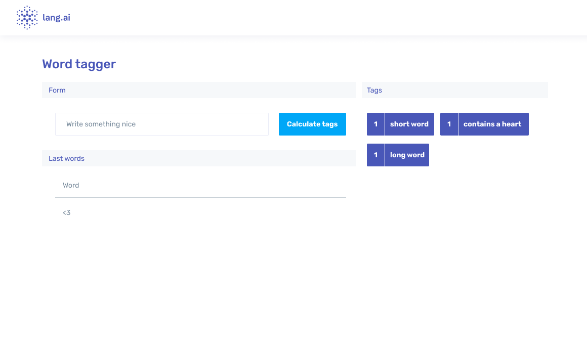

# FrontEnd (Quick) Technical Test

👩‍💻 Welcome to Lang's FrontEnd (Quick) Technical Test!

This test will take **~45 minutes**, we will evaluate your skills but not waste your time, so, let's dive in.

## Installation

The project requires `node > 14`, so check if you have the correct version.
Install yarn globally `npm install -g yarn`, then install the dependencies with `yarn`.

## Project Info

The project itself contains:
- The API `/api`, a simple node project with express~running on `localhost:1994`. You have the information about the API inside the website.
- The React app `/react`, a simple react app with typescript and a super standard architecture.

Start the project with the command `yarn run start`.
Check that everything is running smoothly 🦑 
- React app on [localhost:3000](http://localhost:3000)
- The api on [localhost:1994](http://localhost:1994)

## The test™

The main idea is to create a basic form with an input and a button, and show the tags returned by the api.
When the button is pressed, the app will send a request to the API with the input content on the body, then the api will respond with an array of words, and each word with an array of tags (more info on localhost:1994).

Design approximation:

## You can do it! 💪

Don't worry and relax, this is not an exam, we are just interested in how you approach and resolve the test, but everyone has different ways to do it, don't worry.

Feel free to modify anything in the project.

Please contact us if you have any question. 📠